# ESCARAMUZAS DE CAFÉ 
#### E.D.C. Fantasy Wargame - v0.2.0

 

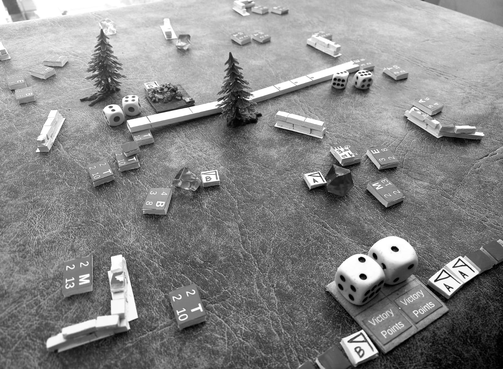 

   

<h3 align="center"> EL JUEGO </h3>
<b>EDC</b>: Es un juego de mesa diseñado para ser desarrollado en el tiempo que demora esperar y beber un café (20, 30min).  Con un sistema de juego simple, rápido y a la vez divertido, supone una pequeña batalla (escaramuza) entre dos bandos de criaturas sedientas de dominio territorial. 

Las unidades no tienen estereotipo, lo cual hace al juego bastante agnostico, de heco, si quieres simular una situación histórica o un mundo fantastico futurista puedes hacerlo. Las unidades tienen sus propias características sobre ellas, lo que ayuda a simplificar los movimientos y tiradas de dados.  
Los tamaños rondan los 2 cm la unidad, para que puedas transportarlo en una pequeña bolsa a donde desees. Puedes jugar 1vs1,  2vs2 o más. (hemos jugado 2v2 y resulta muy divertido!).  
El objetivo primordial es que cualquera pueda sentarse, jugar y compartir un buen momento. 🫂  

	
Completamente <b>Open-Source y PNP (print & play)</b>. Imprime 🖨️ Arma 🛠️ Juega 🎲. 
Sientete libre de modificar a tu gusto lo que consideres que será mas divertido y, si crees que puedes agregarle algo, compartelo aqui mismo.
  
	
<h3 align="center"> QUE NECESITAS PARA JUGAR </h3>
<b>
ℹ️ Practicamente puedes imprimir todo y jugar. ✂️ 
</b>
 
 
• Dos ejércitos de 15 Unidades cada uno. (puede ser menos, si quieres que sea más rápido) 
• 4 🎲 dados de seis caras (4D6) por jugador. (aunque con solo 4 es suficiente)  
• Lápiz y papel para anotar tus conquistas y puntos de victoria. (Nosotros usamos 2 dados extra)  
• Una regla, o similar, para calcular las distancias de movimiento (13cm) y disparo ( movimiento + 11cm ) 
• Una superficie plana para jugar de 90x60cm funciona bien. (Incluso lo jugamos en la mesa del bar 🍺). 
• Terrenos como bosques, rocas, edificios y/o ciudades son opcionales, pero hacen al juego mucho más divertido! (puede ser cartulina, cajitas de carton, fieltro, dibujados en papel y hasta <b>dibujado con Tiza en el suelo. Y créeme que este último fue un éxito!!</b>). 
• Los terrenos como bosques o pantanos son aproximadamente entre 3cm a 5cm.  
• Marcadores de puntos de control 🚩 (puede ser cualquier cosa. Hemos usado hasta pequeñas monedas). 
 

<h3 align="center"> 🛠️ COMO ARMARLO </h3>
 
 • Puedes imprimir todo y jugar, o mejor aún, armarlo con lo que tengas a mano, por ejemplo, cubos de madera, tapitas, etc. En mi caso use un cartel de plástico y pegué sobre las piezas imágenes de las unidades. (las imprimí en A4 300g). 
 • 🖌️ Los tokens o marcadores de salud y estado son del mismo material, solo que los pinté con acrílico. 
 • 🔢 <b>Tokens con números</b>: los uso para el control de salud de las unidades y reducir la cantidad de dados. (y evitar girar las unidades).
 • 🟥 <b>Tokens rojos</b>: los uso para marcar cuando una unidad esta herida o le queda 1 punto de vida.
 • ◼️ <b>Tokens negros</b>: los uso para marcar cuando una unidad esta herida de muerte o bien esta comprometida por alguna otra situación. 
 • 🚩 <b>Tokens banteritas</b>:  los uso para marcar zonas de conquista, así puedo saber de quien es la zona o punto conquistado. (podes usar cualquier cosa)
 • 👺 <b>Unidades</b>: tamaño 20x15x5 largo, alto, profundidad  (en milímetros). Pueden ser mas grandes pero es muy practico el tamaño para transportar el juego. 
 • 🎲 <b>Dados</b>: Para llevar el conteo de puntos de cada jugador y el numero de rondas utilizo 3 dados, aunque no es necesario, practicamente lo puedes anotar en un papel. 
 	

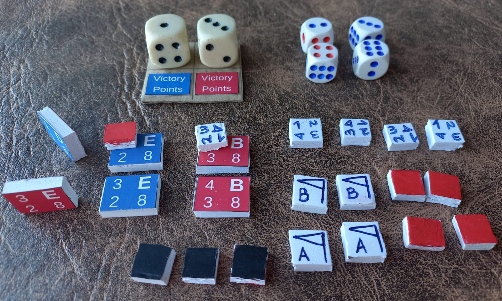 

	
 	
	

	
<h3 align="center"> EJÉRCITOS  </h3> 
 
	
Si bien las unidades son solo bloques y tienen sus propias caracteristicas, para que sea mas divertido usamos algunas letras, nombres e imagenes. (Este punto es completamente ilustrativo y no cumple ninguna funcion en el juego) 
|**Identificador** 	| **Nombre** 	| **Imagen** 	|**Identificador** 	| **Nombre** 	| **Imagen** 	|
|:---:			|:---:		|:---:		|:---:			|:---:		|:---:		|
|  A 			|Alpha 		|  |  M 			|Minguin 	| |
|  B 			|Baramon 	| 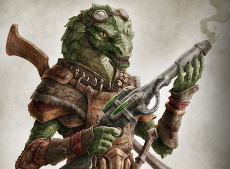 |  T 			|Thanary 	|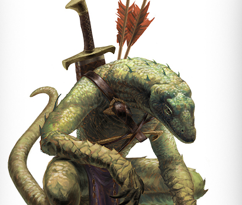 |
|  E 			|Eco   		| 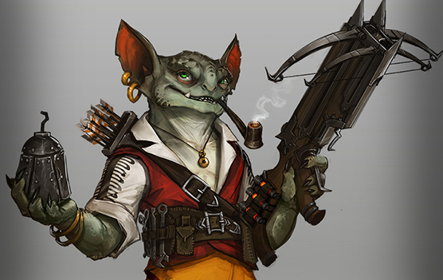 |  D 			|Domucor 	| 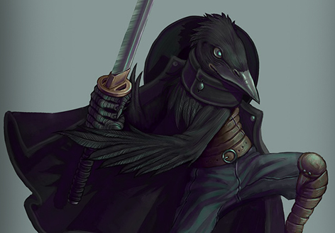 |

<a href="easy-units.pdf"> Unidades simples (PDF)</a> <a href="tokens-de-salud.pdf"> Tokens de salud (PDF) </a>

  
	
<h3 align="center"> CONFIGURACIÓN DEL JUEGO </h3>
 
• Ambos jugadores arman el terreno y colocan los puntos de control. Puede ser aleatoriamente o bien usar un escenario pre-definido.  
• Una vez terminado de armar el terreno, juegan (1D6) y el ganador decide si rotan de posición de terreno o se quedan donde están.  
• Los ejércitos deben desplegarse mínimo a 30 o 40 cm entre sí y a 3 cm del borde del tablero.  (aprox)  
• Al colocar por primera vez las unidades en la mesa, éstas deben estar boca abajo, luego se voltean una vez que inicie la primera partida del juego. (tu contrincante no ve que tipo de unidad está en cada posición hasta que inicia el juego). Esta regla es opcional, pero hace que sea mas divertido. 
• Reparte 4 cartas de habilidades especiales a cada jugador. 

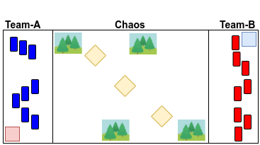

 

<h3 align="center"> TERRENO </h3>
• Áreas de bosques, arroyos, lagos, ciudades, etc. constituyen “Terreno Difícil” que ralentiza el movimiento.  
• Además, terrenos como bosques y torres pueden proporcionar algo de cobertura de los efectos del disparo.  
• Define con tu oponente antes del juego qué terreno cuenta como terreno accidentado y/o cubierta.  
• Los puentes que atraviesan ríos y/o arroyos no cuentan como terreno difícil.  
 

<h3 align="center"> MECÁNICA DE JUEGO Y RONDAS </h3>

<b>1.</b> Determinar la iniciativa (Juega 2D6, quien saque el número más alto inicia) 
<b>2.</b> El número más alto de iniciativa también será la cantidad de <b>Puntos de Acción (PA) para ambos.</b> (la cantidad de unidades que podras activar/utilizar en esa ronda) 
<b>3.</b> Inicia el jugador con iniciativa.  
<b>4.</b> El juego se desarrolla en rondas, con cada jugador alternando la activación de una unidad o pelotón. ( Activa una unidad el jugador A, luego el jugador B activa otra, y así). 
<b>5.</b> Cuando finalizan todas las unidades finaliza la ronda ( Vuelve al punto 1 ) 
• <b>Los objetivos, como ganar el juego y el flujo completo está al final.</b> 

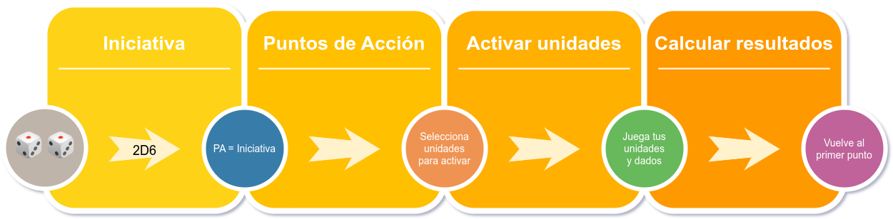

 

<h3 align="center"> PUNTOS DE ACCIÓN (PA) </h3>
 
• Ambos jugadores tiran 2D6 al inicio de cada ronda (iniciativa), el mayor de los dos resultados es el número de Puntos de acción (PA) que estarán disponibles para activar unidades de ambos jugadores en ese turno. 
• Los jugadores pueden gastar o no el máximo de (PA) que obtuvieron en la tirada de PA. 
• Los jugadores siempre tienen dos dados (2D6) de (PA), independientemente del tamaño del ejército, lo que hace que en ejércitos grandes sea más estratégica cada jugada. 
 

<h3 align="center"> ACTIVAR UNIDADES  </h3>

|Acción		|	Descripción	|
|:---:		|:--- 			|
|Quieto		|No mueve, pero puede disparar |
|Caminar	|Camina la mitad de su movimiento y dispara al finalizar el movimiento. |
|Correr         |No dispara, puede correr el máximo de su movimiento. |

 

<h3 align="center"> ZONAS DE CONQUISTA </h3>

 • Las zonas de conquista son puntos en el mapa que puedes conquistar para ganar puntos.
 • Colocar 3, 5 o 7 objetivos, cada uno fuera de las zonas de despliegue y a más de 14 cm de distancia entre sí. Al final de cada ronda, si una unidad está a 3 cm o menos de una de ellas, entonces se captura y pertenece a quien lo conquiste, a menos que el enemigo elimine todas las unidades opuestas y recapture la zona. (recuerda colocar un token o algo para marcar de quien es la zona y anota el punto.)
 • Si las unidades de ambos bandos están disputando una misma zona de conquista, pueden marcarla como neutral, o bien luchar a morir por esa zona.
 

	
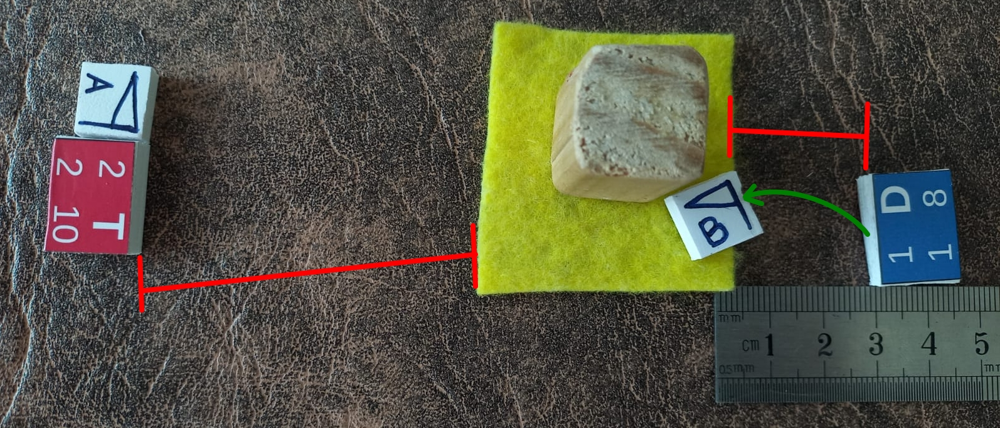

 

<h3 align="center"> MOVIMIENTO EN TERRENOS </h3>
 
<b>• Terreno normal:</b> Las unidades se mueven libremente por terrenos normales. Cada unidad posee su distancia de movimiento. 
 
<b>• Terreno de cobertura:</b> Las unidades que disparan a los enemigos con la o las miniaturas a cubierto obtienen -1 en las tiradas para impactar.
 
<b>• Terreno Difícil:</b> Las unidades que se mueven a través de terrenos difíciles se mueven a la mitad de su movimiento normal.
 
<b>• Terreno peligroso:</b> Las miniaturas que se mueven por terreno peligroso, mueven igual que en terreno difícil, pero deben tirar 1D6. 
Si el resultado es un éxito la unidad recibe una herida.
 

	
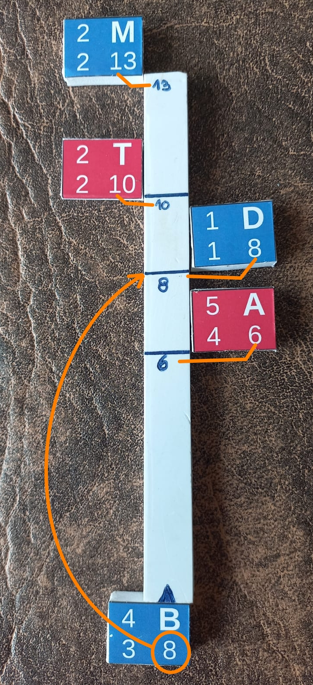

 

 

<h3 align="center">ATAQUE A DISTANCIA </h3>
 
• Las unidades atacan a una distancia de 24cm (regla de movimiento 13cm + regla de ataque 11cm) 
• Las unidades atacan con (2D6) en combates a distancia. 
• Los aciertos son:  4, 5 o 6
• Cada fallo crítico (1) provoca una herida 
• Si en combate se obtiene 🎲🎲 (doble 1), la unidad entra en pánico y se retira la unidad del juego.  
• Los árboles y paredes pueden funcionar como terreno de cobertura  
• Las unidades solo pueden disparar una vez por turno. (a menos que tengan habilidades especiales) 
 

<h3 align="center"> ATAQUE CUERPO A CUERPO (CC) </h3>
 
 
• Dos unidades a menos de (3cm), se enfrentarán cuerpo a cuerpo (CC).  
• Las unidades atacan con (3D6) en cuerpo a cuerpo (CC). 
• Los aciertos son:  4, 5 o 6
• Cada fallo crítico (1) provoca una herida 
• Si se obtienen 🎲🎲🎲 (triple 1), la unidad entra en pánico y se retira la unidad del juego cuenta como destruido a efectos de puntos de victoria. 
• Si una unidad enemiga es destruida en combate (CC), entonces la unidad victoriosa puede avanzar directamente hacia adelante, a menos que el enemigo tenga una unidad de apoyo que se mueva hacia adelante para hacer contacto.  
• Si se contacta con una unidad enemiga como resultado del avance, se combate (CC) inmediatamente. 
 

<h3 align="center"> HERIDAS </h3>
 

• Cada vez que una unidad en defensa saca un fallo crítico, recibe una herida. Juega 1D6 para verificar el tipo de herida. La unidad solo puede soportar 3 puntos de herida, luego de eso queda fuera de combate. 
 
	

|Dado |resultado  |Puntos de herida |
|:---:  |:---|:---:|
| 1 - 4 |🤕 Levemente Herido | 1 |
| 5 - 6 |🩸 Gravemente herido| 2 |

<h3 align="center"> TIPOS DE TIRADA  </h3>

|Numero de dado | Tipo de tirada |
|:---:           |:---|
|  1            |💀 Fallo Crítico  |
| 2,3           |😞 Fallo |
| 4,5           |😃 Acierto |  
|  6            |💥 Éxito  |

<b>Todos los impactos se anotan con una tirada de 4 o más. Excepto que existan modificadores.</b>
 

• Cada golpe acertado se aplica inmediatamente. 
• Las unidades poseen su numero de dados de defensa o evadir. 
• Si el atacante acierta, el enemigo puede “EVADIR” sacando un valor similar o mayor. Para ello debe jugar la cantidad de dados que indica su unidad. Los éxitos no se pueden evadir. 
 

	
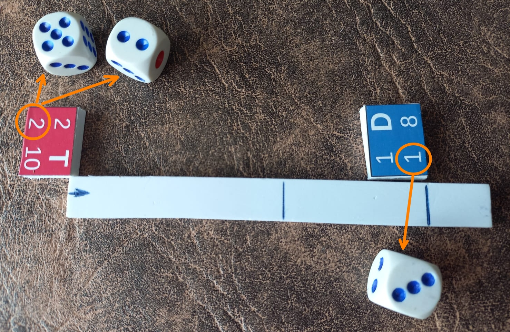

 

<h3 align="center"> TABLA DE REFERENCIA  </h3>

Si bien las unidades traen los puntos de referencia, aqui estan por si no quieres imprimir nada. 
 <b>• ID:</b> Identificador de unidad.
 <b>• Nombre:</b> Nombre táctico de la unidad
 <b>• Salud:</b> Salud de la unidad. 
 <b>• Resistencia:</b> Capacidad de Esquivar/Evadir golpes (cantidad de dados que juega en defensa).
 <b>• AD:</b> Ataque a distancia.
 <b>• CC:</b> Ataque cuerpo a cuerpo.
 <b>• Movimiento:</b> La distancia máxima que puede mover (cm)

|ID |  Nombre | Salud 	| Resistencia 	| AD  	| CC  	| Movimiento 	| 
|:---:|:---:  |:---:  	|:---:        	|:---:	|:---:	|:---:       	|
|D  |Domucor    |1	|1		|2	|3	|8		|
|T  |Thanary    |2	|2		|2	|3	|10		|	
|M  |Minguin   |2	|2		|1	|2	|13		|
|E  |Eco      |3	|2		|2	|3	|8		|
|B  |Baramon    |4	|3		|2	|3	|8		|
|A  |Alpha    |5      	|4            	|2    	|3    	|6           	|

• Los jugadores siempre tienen dos dados para (PA), independientemente del tamaño del ejército.
 • Si bien se calculan 15 unidades, siéntase libre de agregar más o menos unidades. (cuanto mas unidades, mas complejo es, cuanto menos unidades más rápido).
 

<h3> SUBIR DE RANGO  </h3>	

 • Las unidades pueden subir de rango. Para ello deben destruir algunas unidades enemigas. 
 • Cuando una unidad sube de rango entra al campo de batalla como si fuera una completamente saludable y levanta una carta del mazo de habilidades.  
	

 
	
|Unidad	| Unidades enemigas destruidas 	| Acción 		| 
|:---:	|:---				|:---			|
|Domucor  | Destruye 1 unidad enemiga     | Levanta una carta  	|
|Thanary  | Destruye 2 unidades enemigas  | Levanta una carta  	|	
|Minguin | Destruye 2 unidades enemigas  | Levanta una carta  	|	
|Eco    | Destruye 3 unidades enemigas  | Levanta una carta  	|
|Baramon  | Destruye 3 unidades enemigas  | Levanta una carta  	|
|Alpha  | Destruye 3 unidades enemigas  | Levanta una carta  	|
	

 

<h3> CARTAS DE HABILIDADES ESPECIALES </h3>

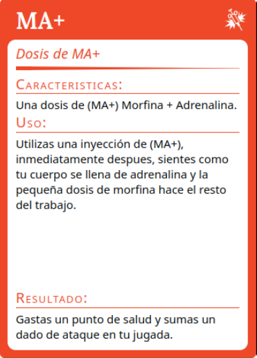 
<a href="RPG-cards.pdf">( CARTAS PDF)</a> 

	
 • Todas las cartas deben descartarse al mazo una vez utilizadas. 
 • Cuando juegues con habilidades especiales mezcla el mazo de cartas especiales y reparte 4 a cada jugador. Las cartas una vez usadas vuelven al mazo. Las restantes servirán para cuando una unidad ascienda de rango.

 

<h3 align="center"> UNIDADES ESPECIALES </h3>
 <b>• Minguin:</b> Esta unidad permite curar 1 punto de salud a una unidad aliada y hasta 2 puntos de heridas. El Minguin puede utilizar el turno para curar o disparar, no puede hacer ambas en el mismo turno.
 • Para curar una unidad, debe estar en contacto (CC).
 • La unidad a curar no puede estar en rango de ataque enemigo. 
 
 

<h3 align="center"> USO DE TOKENS Y UNIDADES </h3>

 
• Los tokens (contadores giratorios) no son obligatorios, pero permiten minimizar la cantidad de dados, evitar girar las unidades y mover las posiciones de las mismas, manteniendo siempre la dirección original.
 

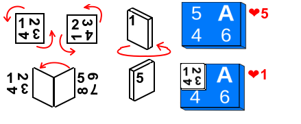 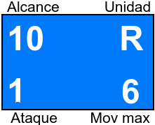
 
 

 

<h3 align="center">  PUNTOS DE VICTORIA </h3>

|Objetivo | puntos |
|:---|:---:|
|Controlar objetivo. 											|🥉 (1PV)|
|Tener al menos una unidad en la zona del enemigo 							|🥉 (1PV)|
|Destruir por lo menos 1 enemigos a distancia en una ronda						|🥉 (1PV)|
|Destruir por lo menos 1 enemigos a CC 	en una ronda							|🥉 (1PV)|
|Destruir por lo menos 3 enemigos a distancia en una ronda						|🥈 (2PV)|
|Destruir por lo menos 3 enemigos a CC 	en una ronda							|🥈 (2PV)|
|Tener al menos 3 unidades en la zona del enemigo 							|🥈 (3PV)|
|Controlar un objetivo antes que tu oponente y mantenlo hasta el fin del juego 				|🥈 (3PV)|
|Destruir por lo menos 6 enemigos a CC 									|🥇 (5PV)|
|Destruir por lo menos 6 enemigos a distancia 								|🥇 (5PV)|
|Controlar todos los objetivos en una ronda								|🎖️ (6PV)|

Siéntete libre de ajustar estos valores para representar ejércitos más fuertes o más débiles, para escenarios específicos , para juegos más largos y estratégicos o bien juegos más cortos para la hora del café
  

<h3 align="center">  GANAR EL JUEGO  </h3>

<b>A) Dominar al enemigo:</b> El primer jugador que quede con 3 unidades, o menos, será derrotado. 
 <b>B) Dominar el campo de batalla:</b> Al final de cada ronda los jugadores chequean si pueden completar al menos un objetivo. Si lo logran, anotan los puntos.  Al final de 6 rondas quien sume más puntos gana la partida. 
  

<h3 align="center">  RESUMEN Y LÓGICA FUNCIONAL</h3>

 
 • Habilidades especiales: Reparte 4 cartas de habilidades especiales. 
 • Juega iniciativa: juega 2d6 (el mas alto gana). 
 • Puntos de acción: utiliza los PA y activa unidades. (usa el mayor número en Iniciativa para ambos jugadores)
 • Activar unidades: inicia el jugador con mayor iniciativa, activando una unidad, luego el otro jugador activa otra unidad y así sucesivamente. 
 

|Acción|		Descripción|
|:---:|:---|
|Quieto        		|No mueve, pero puede disparar. |
|Caminar		|Camina la mitad de su movimiento y dispara al finalizar el movimiento.|
|Correr        		|No dispara, puede correr el máximo de su movimiento. |
|Habilidad especial 	|Juega una carta de habilidad especial. |

• Daños: calcular daños si los hay
 • Heridas: calcular heridas si las hay
 • Subir de rango: Chequea si una unidad puede subir de rango. Si es así, levanta una carta de habilidad especial. 
 • Resultados: una vez que todas las unidades de ambos jugadores fueron activadas se verifica y calcula puntos de “Dominar el campo de batalla”.
 • Vuelve al punto 2. 

  

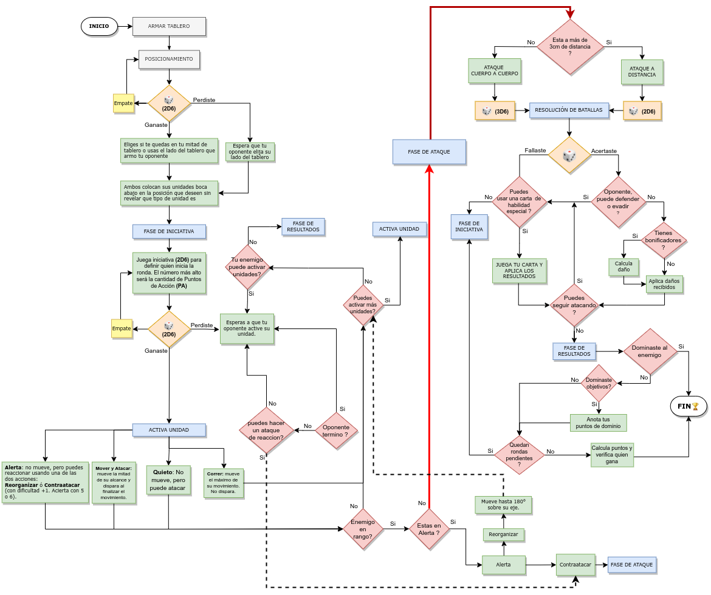

