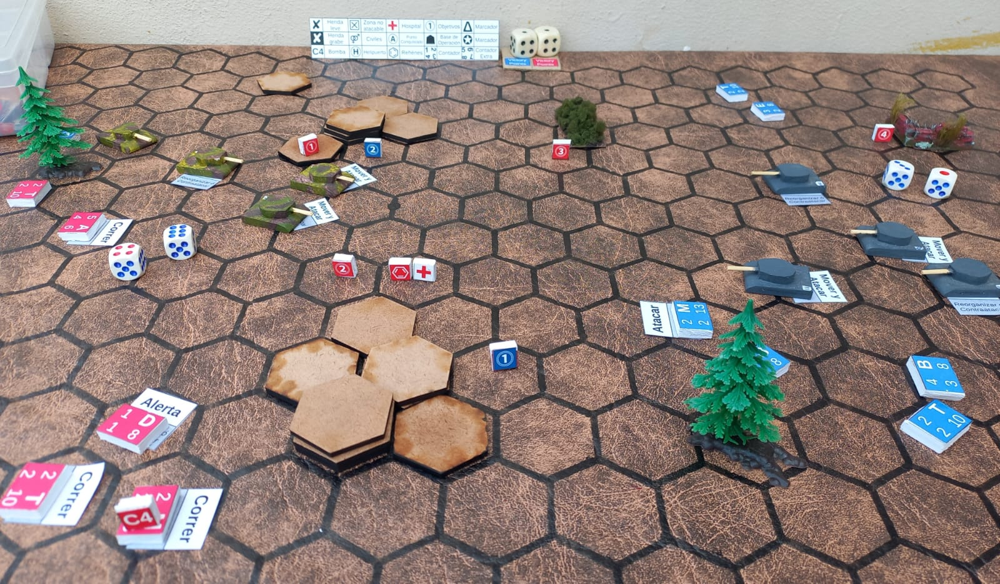
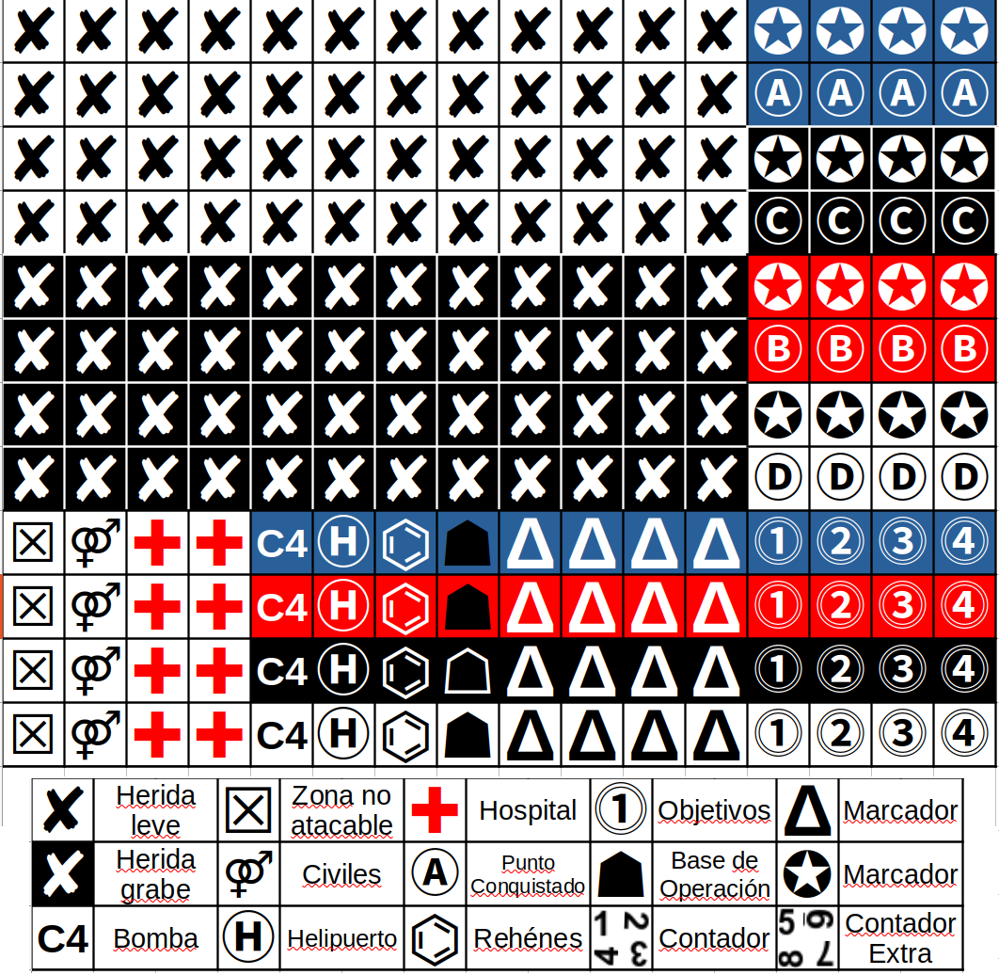
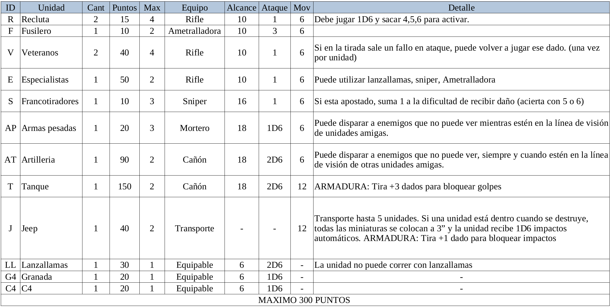
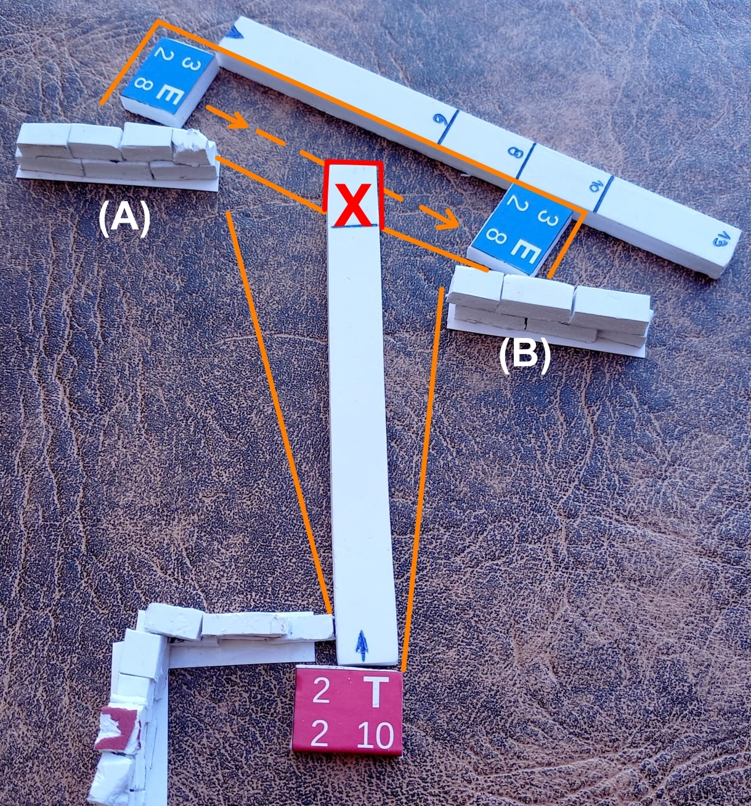
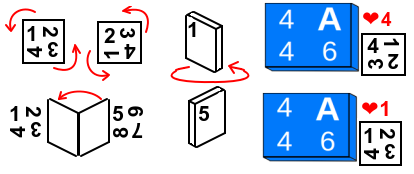
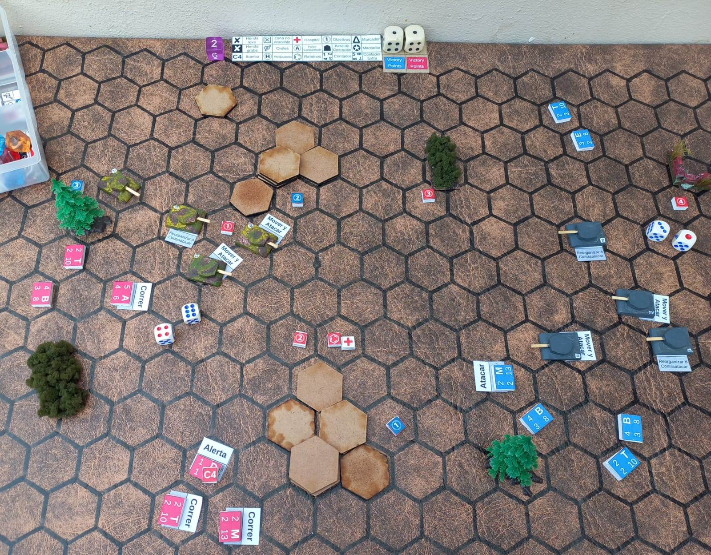

# ESCARAMUZAS DE CAFÉ 
#### E.D.C. Fantasy Wargame - v0.2.1

 

 

   

<h3 align="center"> EL JUEGO </h3>
<b>EDC</b>: Es un juego de mesa diseñado para ser desarrollado en el tiempo que demora esperar y beber un café (30min).  Con un sistema de juego simple, rápido y a la vez divertido, supone una pequeña batalla (escaramuza) entre dos bandos de criaturas sedientas de dominio territorial. 

Las unidades no tienen estereotipo, lo cual hace al juego bastante agnostico, de hecho, si quieres simular una situación histórica o un mundo fantastico futurista puedes hacerlo. Las unidades tienen sus propias características sobre ellas, lo que ayuda a simplificar los movimientos y tiradas de dados.  
Los tamaños rondan los 2 cm la unidad, para que puedas transportarlo en una pequeña bolsa a donde desees. Puedes jugar 1vs1,  2vs2 o más. (hemos jugado 2v2 y resulta muy divertido!).  
El objetivo primordial es que cualquiera pueda sentarse, jugar y compartir un buen momento. 🫂  

	
Completamente <b>Open-Source y PNP (print & play)</b>. Imprime 🖨️ Arma 🛠️ Juega 🎲. 
Sientete libre de modificar a tu gusto lo que consideres que será mas divertido y, si crees que puedes agregarle algo, compartelo aqui mismo.
  
	
<h3 align="center"> QUE NECESITAS PARA JUGAR </h3>
<b>
ℹ️ Practicamente puedes imprimir todo y jugar. ✂️ 
</b>
 
 
• 4 🎲 dados de seis caras (4D6) por jugador. (aunque con solo 4 es suficiente)  
• 2 dados para anotar tus conquistas y puntos de victoria. (Nosotros usamos 2 dados extra)  
• Una regla, o similar, para calcular las distancias de movimiento, si usas un mapa de hexagonos puedes omitir las reglas de distancia. 
• Una superficie plana para jugar de 90x60cm funciona bien. (Incluso lo jugamos en la mesa del bar 🍺). 
• Terrenos como bosques, rocas, edificios y/o ciudades son opcionales, pero hacen al juego mucho más divertido! (puede ser cartulina, cajitas de carton, fieltro, dibujados en papel y hasta <b>dibujado con Tiza en el suelo. Y créeme que este último fue un éxito!!</b>). 
• Marcadores de puntos de control 🚩 (puede ser cualquier cosa. Hemos usado hasta pequeñas monedas). 
 

<h3 align="center"> 🛠️ COMO ARMARLO </h3>
 
 • Puedes imprimir todo y jugar, o mejor aún, armarlo con lo que tengas a mano, por ejemplo, cubos de madera, tapitas, etc. En mi caso use un cartel de plástico y pegué sobre las piezas imágenes de las unidades. (las imprimí en A4 300g). 
 • 🔢 <b>Tokens con números</b>: los uso para el control de salud de las unidades, reducir la cantidad de dados y evitar girar las unidades (Puedes usar dados si prefieres).
 • X  <b> blanca/negra</b>: para marcar cuando una unidad recibe 1 o más puntos de herida.
 • 🚩 <b>Tokens de conquista</b>: los uso para marcar zonas de conquista, así puedo saber de quien es la zona o punto conquistado. (pueden ser los numeros o letras)
 • 👺 <b>Unidades</b>: tamaño, en milímetros, 20x15x5 largo, alto, profundidad. Pueden ser mas grandes pero es muy practico el tamaño para transportar el juego. 
 • 🎲 <b>Dados</b>: para llevar el conteo de puntos de cada jugador y el numero de rondas utilizo 3 dados, aunque no es necesario, practicamente lo puedes anotar en un papel. 
 • <b>Extra tokens</b>: los demás tokens no son necesarios, si quieres jugar misiones o agregar extras para mas realismo o diversion puedes usarlos a tu gusto. 
  	

 
 
 
<a href="all-tokens.pdf"> Tokens (PDF) </a>

	
 	

<h3 align="center"> EJÉRCITOS  </h3> 
 

	

 
<a href="unidades-para-imprimir_v2.1.pdf"> Unidades simples (PDF)</a> 

  

<h3 align="center"> PUNTOS DE ACCIÓN (PA) </h3>
 
• Ambos jugadores tiran 2D6 al inicio de cada ronda (iniciativa), el mayor de los dos resultados es el número de Puntos de acción (PA) que estarán disponibles para activar unidades de ambos jugadores en ese turno. 
• Los jugadores pueden gastar o no el máximo de (PA) que obtuvieron en la tirada de PA. 
• Los jugadores siempre tienen dos dados (2D6) de (PA), independientemente del tamaño del ejército, lo que hace que en ejércitos grandes sea más estratégica cada jugada. 
 

<h3 align="center"> ACTIVAR UNIDADES  </h3>

	
|**Activación (acción principal)**  |**Reacción (acción secundaria)**	 		|
|:---:			     |:---:		 				|
|Alerta			     |Reorganizar ó Contraatacar|
|Atacar			     |Contraatacar 				|
|Mover + Atacar	     |Reorganiza	 			|
|Correr (Mover+Mover)|Al suelo		 				|

  
  
  
<a href="cartas-activacion.pdf">CARTAS ACTIVAR UNIDADES (PDF)</a> 

 

<h3 align="center"> CARTAS DE ACTIVACIÓN DE UNIDADES  </h3>	
	
|**Acción** 		    | **Descripción** 	|
|:---:			    |:--- 			    |
|Atacar         |No se mueve, puede disparar. |
|Contraatacar   |No mueve, puede atacar con dificultad +1 (acierta con 5 o 6) |
|Mover y Atacar |Mueve hasta 6”, puede disparar solo después de moverse. |
|Reorganizar    |Gira hasta 180° sobre su eje. No puede atacar. |
|Correr         |Mueve hasta 12”, no puedes disparar. |
|Alerta         |No se mueve, puede disparar en reacción al enemigo o reorganizar |
|Al suelo       |No se mueve, no puede disparar, obtiene +1 dado a las tiradas de bloqueo. |

 

<h3 align="center"> MECÁNICA DE JUEGO Y RONDAS </h3>

<b>1.</b> Determinar la iniciativa (Juega 2D6, quien saque el número más alto inicia. En caso de empate vuelven a tirar dados)
 <b>2.</b> El número más alto de iniciativa también será la cantidad de <b>Puntos de Acción (PA) para ambos.</b> (la cantidad de unidades que podras activar/utilizar en esa ronda)
 <b>3.</b> Inicia el jugador con mayor iniciativa. 
 <b>4.</b> Todos los jugadores colocanuna boca abajo una carta de activación al lado de las unidades que desean utilizar. 
 <b>5a.</b> El juego se desarrolla en rondas, con cada jugador alternando la activación de una unidad o pelotón. ( Activa una unidad el jugador A, luego el jugador B activa otra, y así).
 <b>5b.</b> Para "Activar" una unidad basta con dar vuelta la carta de activación y ejecutar la acción principal que dice en ella. Una vez colocada la carta de activacion no se puede cambiar por otra.
 <b>5c.</b> Realizar una "Reacción"  <b>ver REACCIÓN</b>
 <b>6.</b> Cuando finalizan todas las unidades finaliza la ronda ( Vuelve al punto 1 )
 • <b>Los objetivos, como ganar el juego y el flujo completo está al final.</b> 

 

<h3 align="center"> ZONAS DE CONQUISTA </h3>

 • Las zonas de conquista son puntos en el mapa que puedes conquistar para ganar puntos.
 • Colocar 3, 5 o 7 objetivos, cada uno fuera de las zonas de despliegue y a más de 14 cm de distancia entre sí. Al final de cada ronda, si una unidad está a 3 cm o menos de una de ellas, entonces se captura y pertenece a quien lo conquiste, a menos que el enemigo elimine todas las unidades opuestas y recapture la zona. (recuerda colocar un token o algo para marcar de quien es la zona y anota el punto.)
 • Si las unidades de ambos bandos están disputando una misma zona de conquista, pueden marcarla como neutral, o bien luchar a morir por esa zona.
 
 

<h3 align="center"> MOVIMIENTO EN TERRENOS </h3>
 
<b>• Terreno normal:</b> Las unidades se mueven libremente por terrenos normales. Cada unidad posee su distancia de movimiento. 
 
<b>• Terreno de cobertura:</b> Las unidades que disparan a los enemigos con la o las miniaturas a cubierto obtienen -1 en las tiradas para impactar.
 
<b>• Terreno Difícil:</b> Las unidades que transiten a través de terrenos difíciles se mueven a la mitad de su movimiento normal.
 
<b>• Terreno peligroso:</b> Las miniaturas que transiten por terreno peligroso, mueven igual que en terreno difícil, pero deben tirar 1D6. 
Si el resultado es un éxito la unidad recibe una herida.
 • <b>Regla de movimiento</b>: Puedes usar la clasica "Cinta métrica", en mi caso, arme una regla con las medidas de movimiento para que sea más practico.
 
 

<h3 align="center"> TIPOS DE TIRADA 🎲 </h3>

|Numero de dado | Tipo de tirada |
|:---:           |:---|
|  1            |💀 Fallo Crítico  |
| 2,3           |😞 Fallo |
| 4,5           |😃 Acierto |  
|  6            |💥 Éxito  |

 

<h3 align="center"> REACCIÓN </h3>
 
 • La <b>reacción</b> te permite realizar un cambio de planes ante un evento del enemigo. Siemrpe que sea tu turno de juego. La reacción puede ser utilizada como un "<b>cambio de planes repentino!!!</b>". Es decir, si pensabas utilizar tu accion principal, "Correr (Mover+Mover)", y tu oponente realiza primero que tú algún movimiento potencialmente peligroso, puedes utilizar tu "Reacción" como acción principal, hacer un "cambio de planes" 

 • <b>Ataque de reacción (distinto de contraatacar)</b>: Es un accion en la cual no estás en tu turno activo (es decir, esta jugando tu oponente) pero se da la situación en que tu oponente esta en pleno movimiento y también está en tu rango directo de vision y ataque. En este punto podrías reaccionar. Para realizar un ataque de reacción juegas 🎲 (1D6) y si sale 5 ó 6 aciertas el disparo. Este daño no se puede evadir ni esquivar ya que la unidad está en plena acción. 

 En este ejemplo la unidad azul(E) esta en su turno y en pleno movimiento del punto (A) al punto (B), pero también esta en completo rango de visión y ataque de la unidad roja(T). Entonces mientras la unidad azul(E) esta corriendo hacia su nueva posición la unidad roja(T) puede hacer un "Ataque de reacción".

 

<h3 align="center"> HERIDAS </h3>
 

• Cada vez que una unidad saca un fallo crítico (1), recibe una herida. Juega 1D6 para verificar el tipo de herida. 
 • La unidad solo puede soportar 3 puntos de herida, luego de eso queda fuera de combate. 
 
	

|Dado |resultado  |Puntos de herida |
|:---:  |:---|:---:|
| 1 - 4 |🤕 Levemente Herido | 1 |
| 5 - 6 |🩸 Gravemente herido| 2 |

  

<h3 align="center"> USO DE TOKENS Y UNIDADES </h3>

 
• Los tokens (contadores giratorios de salud) no son obligatorios, pero permiten minimizar la cantidad de dados, evitar girar las unidades y mover las posiciones de las mismas, manteniendo siempre la dirección original. 
  

 
 
 

 

<h3 align="center">  PUNTOS DE VICTORIA </h3>

|Objetivo | puntos |
|:---|:---:|
|Destruir una unidad enemiga									|🥉(1PV)|
|Tener al menos una unidad en la zona de inicio del enemigo 					|🥉(1PV)|
|Controlar objetivo. 										|🥈(2PV)|
|Controlar la base enemiga									|🎖️(5PV)|
  

<h3 align="center">  GANAR EL JUEGO  </h3>

<b>A) Dominar al enemigo:</b> El primer jugador que quede con 3 unidades, o menos, será derrotado. 
 <b>B) Dominar el campo de batalla:</b> Al final de cada ronda los jugadores chequean si pueden completar al menos un objetivo. Si lo logran, anotan los puntos.  Al final de 12 rondas quien sume más puntos gana la partida. 
  

  
<h3 align="center">  RESUMEN Y LÓGICA FUNCIONAL</h3>

 
 • Habilidades especiales: Reparte 4 cartas de habilidades especiales. 
 • Juega iniciativa: juega 2d6 (el mas alto gana). 
 • Puntos de acción: utiliza los PA y activa unidades. (usa el mayor número en Iniciativa para ambos jugadores)
 • Activar unidades: inicia el jugador con mayor iniciativa, activando sus unidades y luego el otro jugador activa sus unidades y así sucesivamente. 
 • Reacción: Solo si tienes puntos de reacción puedes realizar un ataque a tu enemigo. (aunque no sea tu turno).
 • Daños: calcular daños si los hay
 • Heridas: calcular heridas si las hay
 • Subir de rango: Chequea si una unidad puede subir de rango. Si es así, levanta una carta de habilidad especial. 
 • Resultados: una vez que todas las unidades de ambos jugadores fueron activadas se verifica y calcula puntos de “Dominar el campo de batalla”.
 • Vuelve al punto 2. 

  

   
  

<h3 align="center">  EN ETAPA EXPERIMENTAL</h3>
  

<h3> SUBIR DE RANGO  </h3>	

 • Las unidades pueden subir de rango. Para ello deben destruir algunas unidades enemigas. 
 • Cuando una unidad sube de rango entra al campo de batalla como si fuera una completamente saludable y levanta una carta del mazo de habilidades.  
 

<h3> CARTAS DE HABILIDADES ESPECIALES  (beta-test)</h3>

 
<a href="RPG-cards.pdf">( CARTAS PDF)</a> 

	
 • Todas las cartas deben descartarse al mazo una vez utilizadas. 
 • Cuando juegues con habilidades especiales mezcla el mazo de cartas especiales y reparte 4 a cada jugador. Las cartas una vez usadas vuelven al mazo. Las restantes servirán para cuando una unidad ascienda de rango.

 

<h3 align="center"> UNIDADES ESPECIALES </h3>
 <b>• Minguin:</b> Esta unidad permite curar 1 punto de salud a una unidad aliada y hasta 2 puntos de heridas. El Minguin puede utilizar el turno para curar o disparar, no puede hacer ambas en el mismo turno.
 • Para curar una unidad, debe estar en contacto (CC) o menos de 3cm.
 • La unidad a curar no puede estar en rango de ataque enemigo. 
 
 

<h3 align="center"> REEMPLAZAR REGLA POR MAPA DE HEXAGONOS </h3>
 
Si prefieres evitar las reglas de medidas, puedes jugar con hexágonos de 2cm
 

 

